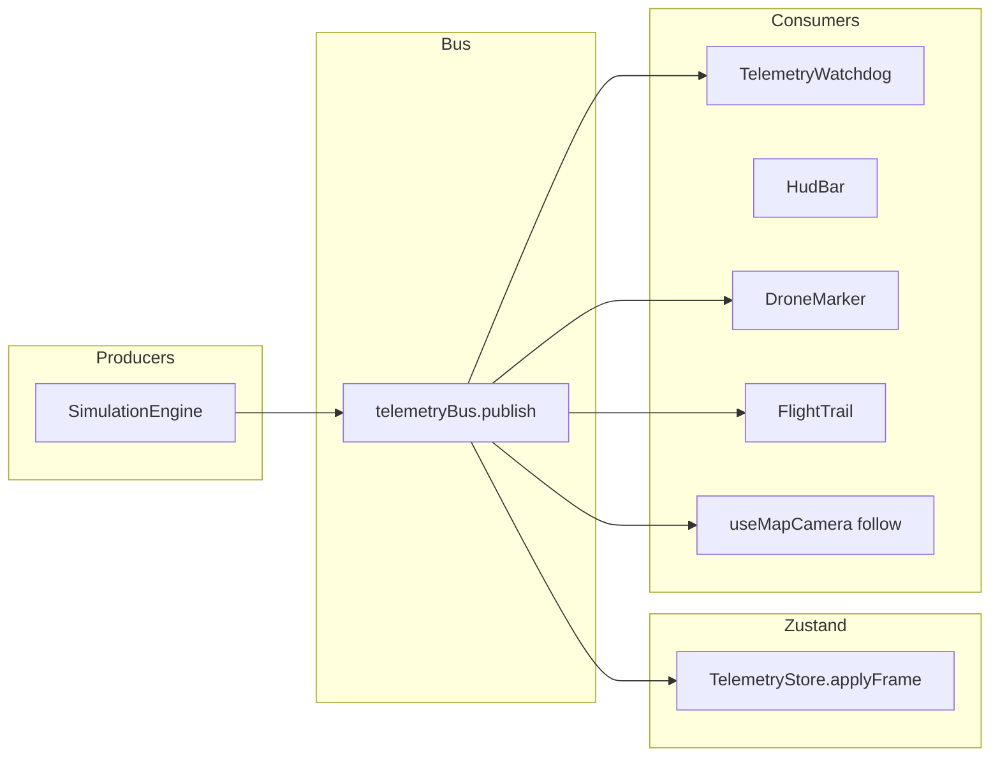

# Architecture

## Layered structure

```text
App.tsx
  └── AppProviders (GestureHandlerRootView, SafeAreaProvider, ThemeProvider, NavigationContainer)
        └── AppErrorBoundary
              └── RootNavigator → native stack: MapHome | TelemetryTerminal (modal)
```

`enableFreeze(true)` is called from [`App.tsx`](../App.tsx) so inactive screens can use React Freeze when configured. `MapHome` sets `freezeOnBlur: true` as a supplementary optimization when another route is focused.

- **`src/app/`** — Composition only: navigation types, providers, runtime hooks (`installGlobalHandlers`, dev perf counters).
- **`src/core/`** — Pure domain: TypeScript types, constants, math/geo helpers, structured logger (no React).
- **`src/modules/`** — Framework-light services: telemetry bus/store, simulation engine, MMKV schemas, offline manager, mission-planning algorithms.
- **`src/features/`** — Screen-level composition and feature hooks (`map`, `mission-planning`).
- **`src/ui/`** — Reusable presentation (theme, HUD, glass panels, boot splash).

## Telemetry data flow



### Design rules

1. **UI does not distinguish “sim vs real”** — only `TelemetryFrame.source` and connection FSM matter.
2. **Hot path avoids unnecessary React renders** — marker and camera subscribe to the bus or use imperative refs; HUD uses throttled selectors.
3. **Persistence is synchronous where first paint matters** — MMKV for camera/follow variant and mission draft snapshots.

## Navigation

`RootNavigator` (`src/app/navigation/RootNavigator.tsx`) uses `@react-navigation/native-stack` with **`MapHome`** as the initial route and **`TelemetryTerminal`** as a full-screen modal for the developer Telemetry Terminal. Future shells (auth, org picker) can wrap or extend this stack without rewriting map feature code.

## Error handling

- **Global:** `index.js` chains `ErrorUtils.setGlobalHandler` to log then delegate to React Native’s default handler (`src/app/runtime/installGlobalHandlers.ts`).
- **React tree:** `AppErrorBoundary` wraps navigation children inside `AppProviders` so a localized render fault does not blank the entire shell.
