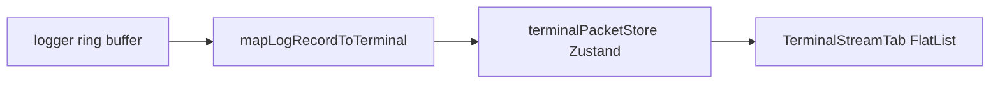

# Telemetry Terminal

Developer-focused workspace for **live structured logs**, **filters**, **session export**, and **inspector shells** (commands, MAVLink, serial). Opened from **Command Hub → Telemetry Terminal** as a full-screen modal over the map.

## Navigation entry

```text
Map HUD (TacticalCommandGlyph) → Command Center → Command Hub card “Telemetry Terminal”
```

`RootNavigator` registers `TelemetryTerminal` as a native-stack screen with `presentation: 'fullScreenModal'` ([`RootNavigator.tsx`](../src/app/navigation/RootNavigator.tsx)).

## Data path



- **`terminalPacketStore`** ([`terminalPacketStore.ts`](../src/features/telemetry-terminal/state/terminalPacketStore.ts)) — ring buffer (`TERMINAL_PACKET_CAP`), batched appends via `requestAnimationFrame` to avoid render storms under burst logging.
- **`logger.subscribe`** attaches once via `ensureTerminalIngestAttached()` when the screen mounts.
- **Filters** — [`terminalFilterEngine.ts`](../src/features/telemetry-terminal/filters/terminalFilterEngine.ts): category toggles, minimum log level, substring search (deferred while typing in the stream UI).

## Export and diagnostics

- **Export** — [`terminalExport.ts`](../src/features/telemetry-terminal/export/terminalExport.ts): JSON Lines, plain text, CSV; metadata includes `APP_VERSION` from [`appVersion.ts`](../src/core/constants/appVersion.ts).
- **Diagnostics** — [`telemetryDiagnostics.ts`](../src/features/telemetry-terminal/diagnostics/telemetryDiagnostics.ts): staleness / connection hints surfaced in [`TelemetryAlertsBanner`](../src/features/telemetry-terminal/components/TelemetryAlertsBanner.tsx).

## Performance choices while the terminal is open

| Mechanism | Location | Behavior |
|-----------|----------|----------|
| Simulation pause | [`TelemetryTerminalScreen`](../src/features/telemetry-terminal/screens/TelemetryTerminalScreen.tsx) | `useFocusEffect`: if sim was **RUNNING**, `pause()` on focus; `resume()` on blur only if this screen paused it. |
| Map route light mode | [`MapHomeScreen`](../src/features/map/screens/MapHomeScreen.tsx) | `useIsFocused`: when another route covers the map (e.g. Telemetry Terminal), skip HUD, offline UI, mission planner panel, sim/camera controls, and mission overlays — MapLibre stays mounted. |
| React Freeze | [`App.tsx`](../App.tsx), [`RootNavigator`](../src/app/navigation/RootNavigator.tsx) | `enableFreeze(true)` globally; `freezeOnBlur: true` on `MapHome` (supplementary; modal stacking may still render the route below). |

## Operator / developer UX

- Monospace stream, optional **TTY dense** rows, shell-style filter prompt (`›`), footer status line (buffer cap, filters, scroll state).
- Category chips use readable labels via [`terminalCategoryLabels.ts`](../src/features/telemetry-terminal/components/terminalCategoryLabels.ts).

## Tests

- [`terminalFilterEngine.test.ts`](../__tests__/terminalFilterEngine.test.ts), [`mapLogRecordToTerminal.test.ts`](../__tests__/mapLogRecordToTerminal.test.ts), [`terminalExport.test.ts`](../__tests__/terminalExport.test.ts), [`telemetryDiagnostics.test.ts`](../__tests__/telemetryDiagnostics.test.ts).
